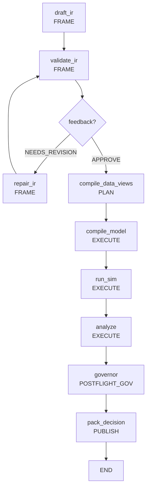

# Scientist: AI Policy Scientist

**AI-driven Policy Design and Orchestration System**

Scientist - это "мозг" Policy Engine, отвечающий за автоматическое проектирование, валидацию и оптимизацию экономических политик с использованием LLM и дифференцируемых симуляций. Модуль реализует полный цикл от естественного языка пользователя до оптимизированного пакета решений.

## Архитектура

Scientist построен как многоуровневая система оркестрации с четким разделением ответственности. Архитектура следует принципам модульной декомпозиции и однонаправленных зависимостей (Закон A), обеспечивая высокую тестируемость и расширяемость. Модуль интегрируется с остальной системой через контракты IR (Закон C) и обеспечивает полную воспроизводимость экспериментов (Закон D).

### 🤖 Agent Layer (Агенты и генерация)

Отвечает за генерацию и принятие решений о политиках через различные стратегии:

- **base.py**: Абстрактный класс `BaseAgent` и `MockAgent` для эвристического принятия решений на основе экономических показателей (безработица, бюджетный баланс). MockAgent создает простые политики налогообложения/субсидий
- **drafter.py**: Узел генерации политики через LLM с поддержкой `MockLLM` для тестирования без API ключей. Включает интеграцию с системными промптами и аудит трейлинг
- **prompts.py**: Системные промпты для LLM с каталогом доступных механизмов политики и селекторов
- **prompt.py**: Альтернативные и специализированные промпты для различных сценариев Policy Scientist

### 🎯 Kernel Layer (Ядро управления)

Обеспечивает контроль выполнения, безопасность и управление жизненным циклом экспериментов:

- **budgets.py**: Строгие модели бюджетов (`ComputeBudget`, `EvidenceBudget`, `LegitimacyBudget`, `ComplexityBudget`) с валидацией Pydantic. ComputeBudget контролирует LLM вызовы, симуляции и время выполнения
- **fsm.py**: Конечный автомат состояний с 9 фазами (`Phase` enum) и строгими правилами переходов (`ALLOWED_TRANSITIONS`). Поддерживает self-healing циклы для исправления ошибок
- **guards.py**: Система проверок переходов между состояниями и валидации артефактов для предотвращения некорректных состояний
- **human_gate.py**: Асинхронная система человеческих ворот для одобрения критических решений (`GateRequest`, `GateDecision`)

### 🔬 Compute Layer (Вычислительные спецификации)

Определяет интерфейсы и спецификации для запуска симуляций и распределенных вычислений:

- **job_spec.py**: Детальные спецификации задач симуляции (`JobSpec`, `JobKey`, `JobResult`) с поддержкой артефактов, seed и метрик. JobKey генерируется как SHA256 хеш от спецификации
- **runner.py**: Интерфейс для запуска вычислительных задач с поддержкой разных бэкендов (`LocalBackend`, `RunnerBackend`). Интегрирован с Foundry executor для выполнения JAX программ

### 📊 Design of Experiments (DoE)

Планирование экспериментов и систематическое исследование сценариев политики:

- **designs.py**: Модели дизайнов экспериментов (`ScenarioSweep`, `AblationPlan`, `SensitivityPlan`) для сравнения политик и анализа чувствительности

### 🛡️ Governance Layer (Управление и безопасность)

Многоуровневый контроль качества, безопасности и соответствия требованиям:

- **preflight.py**: Предварительные проверки безопасности и валидации перед запуском экспериментов (возвращает `GateRequest` при необходимости). Текущая реализация - placeholder
- **postflight.py**: Пост-запусковые проверки результатов и финальное одобрение экспериментов. Текущая реализация - placeholder

### 🎼 Orchestrator Layer (Основная оркестрация)

Управляет полным жизненным циклом экспериментов с использованием LangGraph для декларативного workflow:

- **workflow.py**: Основной граф состояний LangGraph с 9 узлами и системой маршрутизации на основе состояния и фидбэка
- **state.py**: `ExperimentState` (TypedDict с 80+ полями) - центральная структура данных эксперимента с полями для всех этапов workflow
- **flow_nodes.py**: Полные реализации всех узлов workflow (1450+ строк кода) с интеграцией Foundry, Fabric, Core и всех компонентов системы
- **decision_packet.py**: Итоговый артефакт прогона (`DecisionPacket`) с полной информацией о эксперименте, включая fabric_result и evidence_ref
- **run_record.py**: Детальные записи для воспроизводимости (`RunRecord` с метаданными окружения, seed, версиями библиотек)
- **audit.py**: Комплексная система аудита и логирования всех операций с append_audit функцией
- **data_loader.py**: Загрузка и подготовка начальных данных из Fabric layer через SimulationDB и GraphStore
- **nodes.py**: Дополнительные специализированные узлы workflow (устаревший, заменен flow_nodes.py)
- **optimizer.py**: Градиентная оптимизация параметров политик с использованием Optax (placeholder)
- **registry.py**: Управление реестрами компонентов и артефактов (placeholder)

### 📚 Legacy Layer (Устаревший код)

Содержит устаревшие реализации для обратной совместимости:

- **_legacy/**: Папка с устаревшим кодом
  - **compiler.py**: Legacy компилятор для старого `PolicyRequestIR` (deprecated, использовать Surface IR)
  - **nodes.py**: Устаревшие узлы workflow (deprecated, использовать flow_nodes.py)

### 📤 Publisher Layer (Публикация)

Финализация, публикация и экспорт результатов экспериментов:

- **publisher.py**: Публикация решений и артефактов экспериментов с формированием финального `DecisionPacket` через build_decision_packet

## Workflow Pipeline

Scientist реализует декларативный workflow на LangGraph с поддержкой FSM фаз и автоматической маршрутизацией:



### FSM Фазы (Kernel Layer)

Workflow управляется конечным автоматом состояний:

1. **INTAKE**: Начальная фаза, подготовка к эксперименту
2. **FRAME**: Генерация и валидация политики (draft_ir, validate_ir, repair_ir)
3. **PREFLIGHT_GOV**: Предварительные проверки безопасности
4. **PLAN**: Планирование данных и компиляции (compile_data_views)
5. **EXECUTE**: Запуск симуляции (compile_model, run_sim, analyze)
6. **POSTFLIGHT_GOV**: Финальные проверки (governor)
7. **DECIDE**: Принятие решения
8. **PUBLISH**: Публикация результатов (pack_decision)
9. **ARCHIVE**: Архивация эксперимента

### Узлы Workflow

1. **draft_ir** (FRAME): Генерация начальной политики из пользовательского запроса через LLM с использованием системных промптов
2. **validate_ir** (FRAME): Полная валидация структуры и семантики политики с проверкой схемы и бизнес-правил
3. **repair_ir** (FRAME): Автоматическое исправление ошибок валидации через повторные LLM вызовы с анализом diff
4. **compile_data_views** (PLAN): Подготовка DataView запросов для Fabric layer и компиляция UDF функций
5. **compile_model** (EXECUTE): Компиляция политики в дифференцируемые JAX механизмы через Foundry compiler
6. **train_agents** (EXECUTE): Обучение адаптивных агентов с калибровкой параметров через Optax
7. **run_sim** (EXECUTE): Запуск симуляции через Foundry executor с patch-based execution и сбором метрик
8. **analyze** (EXECUTE): Анализ результатов симуляции, расчет экономических метрик и gradient health reports
9. **governor** (POSTFLIGHT_GOV): Финальное решение губернатора на основе бюджетов, безопасности и политик
10. **pack_decision** (PUBLISH): Формирование итогового `DecisionPacket` с полной информацией об эксперименте

## Ключевые возможности

### 🤖 LLM Integration
- Поддержка OpenAI/Anthropic через LangChain
- MockLLM для тестирования без API ключей
- Автоматическая генерация PolicyRequestIR из естественного языка
- Self-healing: исправление ошибок валидации через повторные вызовы

### 🔬 Дифференцируемые симуляции
- Компиляция политик в JAX механизмы (Equinox)
- Градиентная оптимизация параметров через Optax
- Многокритериальная оптимизация (PyMOO)
- Fidelity levels для контроля точности/скорости
- **Agent Training**: Система обучения адаптивных агентов с continuous actions
- **Uncertainty Quantification**: Оценки неопределенности через Hessian analysis
- **Gradient Health Monitoring**: Диагностика проблем с градиентами в оптимизации

### 📊 Data Integration
- Интеграция с Fabric (DuckDB + Kuzu)
- Декларативные DataViewRequest
- PII tiers и access control
- Entity resolution и reconciliation

### 🎯 Governance & Safety
- **Budget Controls**: `ComputeBudget`, `EvidenceBudget`, `LegitimacyBudget`, `ComplexityBudget`
- **FSM Guards**: Проверки переходов между состояниями и валидация артефактов
- **Human Gates**: Система `GateRequest`/`GateDecision` для человеческого одобрения
- **Preflight/Postflight Checks**: Автоматические проверки безопасности
- **Policy Safety**: Валидация запрещенных механизмов и селекторов
- **Audit Trail**: Полный лог всех операций для compliance

### 🔄 Reproducibility & Artifacts
- **RunRecord**: Детальные метаданные о прогоне (seed, backend, версии библиотек, флаги)
- **DecisionPacket**: Итоговый артефакт с IR, результатами, аудитом, evidence и uncertainty bounds
- **Artifact Management**: Content-addressable storage (CAS) с SHA256-based addressing
- **Parent/Child Relationships**: Связи между экспериментами для воспроизводимости
- **Evidence Bundles**: Криптографически verifiable доказательства происхождения данных
- **Fabric Result**: Результаты Fabric layer с evidence references и uncertainty bounds
- **Audit Trail**: Полный JSON Lines лог всех операций с provenance tracking

### ⚙️ Compute & Experiment Design
- **Job Specifications**: `JobSpec`, `JobKey`, `JobResult` для структурированных задач
- **Design of Experiments**: `ScenarioSweep`, `AblationPlan`, `SensitivityPlan`
- **Distributed Execution**: Подготовка к кластерному запуску симуляций

## API и интерфейсы

### Основной вход
```python
from polisyos.scientist.orchestrator.workflow import build_workflow

# Создание workflow
workflow = build_workflow()

# Запуск с пользовательским запросом
result = workflow.invoke({
    "user_request": "Reduce poverty through targeted subsidies",
    "optimize": True,
    "budget": {"max_llm_calls": 3, "max_sim_runs": 2}
})
```

### ExperimentState

Центральная структура данных workflow (TypedDict с 80+ полями), управляющая состоянием эксперимента:

```python
class ExperimentState(TypedDict):
    # Входные данные
    user_request: str  # <--- НОВОЕ ПОЛЕ: "Reduce poverty"
    ir: Optional[PolicySurfaceIR]
    last_ir_json: Optional[str]
    last_error: Optional[str]

    # Управление workflow и FSM
    optimize: Optional[bool]
    run_id: Optional[str]
    parent_run_id: Optional[str]
    repro_mode: Optional[str]
    run_record: Optional[RunRecord]
    runtime_base_dir: Optional[str]
    db_path: Optional[str]
    graph_path: Optional[str]
    baseline_run_id: Optional[str]
    budget: Optional[Dict[str, float]]
    budget_usage: Optional[Dict[str, float]]
    budget_started_at: Optional[float]
    pruning_reason: Optional[Dict[str, Any]]
    pruned: Optional[bool]
    random_seed: Optional[int]
    last_prompt: Optional[str]
    last_llm_response: Optional[str]
    data_view_requests: Optional[List[Dict[str, Any]]]
    data_view_plans: Optional[List[Dict[str, Any]]]
    calibration_config: Optional[Dict[str, Any]]
    calibration_raw_targets: Optional[Dict[str, Any]]
    calibration_controls_seq: Optional[List[Any]]
    calibration_config_ref: Optional[Dict[str, Any]]
    calibration_report_ref: Optional[Dict[str, Any]]
    agent_training_config: Optional[Dict[str, Any]]
    agent_training_report_ref: Optional[Dict[str, Any]]
    agent_weights_ref: Optional[Dict[str, Any]]
    calibrated_params: Optional[Dict[str, float]]
    calibrated_params_ref: Optional[Dict[str, Dict[str, Any]]]
    compiled_model: Optional[Any]
    policy_ir_ref: Optional[Dict[str, Any]]
    program_graph_ref: Optional[Dict[str, Any]]
    exec_plan_ref: Optional[Dict[str, Any]]
    link_report_ref: Optional[Dict[str, Any]]
    compile_report_ref: Optional[Dict[str, Any]]
    state_delta_ref: Optional[Dict[str, Any]]
    metrics_ref: Optional[Dict[str, Any]]
    state_snapshot_ref: Optional[Dict[str, Any]]
    registry_bundle_ref: Optional[Dict[str, Any]]
    cas_root: Optional[str]
    analysis: Optional[Dict[str, Any]]
    decision_packet: Optional[Dict[str, Any]]
    gate_request: Optional[Dict[str, Any]]

    # Результаты симуляции
    simulation_results: Optional[Dict[str, float]]
    simulation_results_ref: Optional[Dict[str, Any]]
    fabric_result: Optional[Dict[str, Any]]  # Результаты Fabric layer с evidence и uncertainty
    uncertainty_ref: Optional[Dict[str, float]]  # Границы неопределенности

    # Обратная связь от Губернатора
    feedback: Optional[GovernorFeedback]

    # Human gate / safety controls
    require_human_gate: Optional[bool]
    gate_decision: Optional[Dict[str, Any]]
    pii_tier: Optional[str]
    uncertainty_bounds: Optional[Dict[str, float]]

    # Execution config
    runner_backend: Optional[str]

    # Счетчик попыток (чтобы избежать бесконечных циклов)
    revision_count: int
    max_repair_attempts: int
    repair_log: List[RepairAttempt]
    audit_trail: List[Dict[str, Any]]
    phase: Optional[str]
```

### Новые модели данных

#### Budget Models
```python
from polisyos.scientist.kernel.budgets import ComputeBudget, EvidenceBudget

compute_budget = ComputeBudget(
    max_llm_calls=3.0,
    max_sim_runs=1.0,
    max_wall_time_s=120.0
)

evidence_budget = EvidenceBudget(max_queries=10)
```

#### FSM Models
```python
from polisyos.scientist.kernel.fsm import Phase, KernelState

# Текущая фаза эксперимента
current_phase = Phase.EXECUTE

# Состояние ядра
kernel_state = KernelState(phase=Phase.FRAME)
can_transition = kernel_state.can_transition(Phase.PLAN)
```

#### Decision Packet
```python
from polisyos.scientist.orchestrator.decision_packet import DecisionPacket

packet = DecisionPacket(
    run_id="exp_001",
    run_record=run_record,
    policy_ir=policy_ir,
    simulation_results={"gdp": 1000.0, "unemployment": 0.05},
    fabric_result=fabric_result,  # Результаты Fabric layer с evidence
    evidence_ref=evidence_bundle,  # Криптографически verifiable доказательства
    uncertainty_ref=uncertainty_bounds,  # Оценки неопределенности через Hessian
    feedback=governor_feedback,
    audit_trail=audit_events
)
```

#### Job Specifications
```python
from polisyos.scientist.compute.job_spec import JobSpec, JobKey

job_spec = JobSpec(
    program_ref=artifact_ref,
    seed=42,
    required_metrics=["gdp", "unemployment"]
)

job_key = JobKey.from_spec(job_spec)
```

### Агенты

```python
from polisyos.scientist.agent.base import BaseAgent, MockAgent

class MyAgent(BaseAgent):
    def decide(self, step: int, context_df) -> PolicyRequestIR:
        # Ваша логика принятия решений
        pass
```

## Примеры использования

### Базовый запуск с MockAgent

```python
from polisyos.scientist.orchestrator.workflow import build_workflow

# Создание и запуск workflow
workflow = build_workflow()
result = workflow.invoke({
    "user_request": "Implement progressive taxation to reduce inequality",
    "run_id": "tax_experiment_001",
    "optimize": True,
    "budget": {"max_llm_calls": 3, "max_sim_runs": 1, "max_wall_time_s": 120}
})

# Получение результатов
decision_packet = result.get("decision_packet")
if decision_packet:
    print(f"Decision: {decision_packet.feedback.verdict if decision_packet.feedback else 'N/A'}")
    print(f"Run ID: {decision_packet.run_id}")

    # Экономические метрики
    results = decision_packet.simulation_results or {}
    print(f"Gini coefficient: {results.get('gini_coefficient', 'N/A')}")
    print(f"Unemployment: {results.get('unemployment_rate', 'N/A')}")

    # Новые поля
    if decision_packet.fabric_result:
        print(f"Fabric data available: {len(decision_packet.fabric_result)} series")
    if decision_packet.evidence_ref:
        print(f"Evidence bundle: {decision_packet.evidence_ref.bundle_id}")
```

### Работа с расширенными бюджетами

```python
from polisyos.scientist.orchestrator.workflow import build_workflow
from polisyos.scientist.kernel.budgets import ComputeBudget, EvidenceBudget, LegitimacyBudget

# Создание детализированных бюджетов
compute_budget = ComputeBudget(
    max_llm_calls=5.0,
    max_sim_runs=3.0,
    max_wall_time_s=300.0
)

evidence_budget = EvidenceBudget(max_queries=20)

legitimacy_budget = LegitimacyBudget(
    require_human_gate=True,
    notes=["Требуется одобрение для социальных программ"]
)

workflow = build_workflow()
result = workflow.invoke({
    "user_request": "Design a universal basic income policy",
    "run_id": "ubi_experiment_002",
    "budget": compute_budget.model_dump(),
    "evidence_budget": evidence_budget.model_dump(),
    "legitimacy_budget": legitimacy_budget.model_dump(),
    "optimize": True
})
```

### Работа с Design of Experiments

```python
from polisyos.scientist.doe.designs import ScenarioSweep, AblationPlan

# Сравнение разных механизмов финансирования UBI
scenarios = ScenarioSweep(scenarios=[
    {"ubi_amount": 500, "funding_source": "income_tax"},
    {"ubi_amount": 750, "funding_source": "wealth_tax"},
    {"ubi_amount": 1000, "funding_source": "carbon_tax"}
])

# Или анализ абляции компонентов политики
ablation = AblationPlan(targets=[
    "ubi_mechanism",
    "progressive_tax_mechanism",
    "wealth_tax_mechanism"
])

workflow = build_workflow()
result = workflow.invoke({
    "user_request": "Compare different UBI funding mechanisms",
    "run_id": "ubi_comparison_003",
    "doe_design": scenarios.model_dump(),  # или ablation.model_dump()
    "optimize": True,
    "budget": {"max_llm_calls": 3, "max_sim_runs": 5}
})
```

### Анализ результатов с Decision Packet

```python
from polisyos.scientist.orchestrator.decision_packet import build_decision_packet

# Получение полного результата
decision_packet = result.get("decision_packet")

if decision_packet:
    print(f"Run ID: {decision_packet.run_id}")
    print(f"Policy Schema: {decision_packet.policy_ir.schema_version}")

        # Экономические метрики
        results = decision_packet.simulation_results
        if results:
            print(f"GDP Impact: {results.get('gdp_change', 'N/A')}%")
            print(f"Unemployment: {results.get('unemployment_rate', 'N/A')}%")
            print(f"Income Inequality (Gini): {results.get('gini_coefficient', 'N/A')}")

        # Новые поля результатов
        if decision_packet.fabric_result:
            print(f"Fabric data processed: {len(decision_packet.fabric_result)} datasets")
        if decision_packet.evidence_ref:
            print(f"Evidence available: {decision_packet.evidence_ref.bundle_id}")
        if decision_packet.uncertainty_ref:
            bounds = decision_packet.uncertainty_ref.bounds
            print(f"Uncertainty bounds: {bounds}")

        # Решение губернатора
        feedback = decision_packet.feedback
        if feedback:
            verdict = feedback.verdict
            print(f"Governor Verdict: {verdict}")

            if verdict == "APPROVE":
                print("✅ Policy approved for implementation")
            elif verdict == "REJECT":
                issues = feedback.issues
                print(f"❌ Rejected due to: {[i.get('message') for i in issues]}")

        # Аудит траил
        audit_events = decision_packet.audit_trail
        print(f"Total audit events: {len(audit_events)}")
```

## Конфигурация и настройки

### Budget Controls

```python
budget_config = {
    "max_llm_calls": 3,      # Максимум вызовов LLM
    "max_sim_runs": 1,       # Максимум запусков симуляции
    "max_wall_time_s": 120,  # Максимум времени выполнения (сек)
}
```

### Оптимизатор настройки

```python
optimizer_config = {
    "steps": 100,
    "learning_rate": 0.05,
    "clip_grad_norm": 1.0,
    "min_balance": -1000.0
}
```

### Governor Rules

Governor принимает решение на основе:
- **Budget constraints**: Дефicit > min_balance
- **Policy safety**: Запрещенные механизмы/селекторы
- **Validation issues**: Критические ошибки структуры

## Разработка и расширение

### Добавление нового агента

```python
from polisyos.scientist.agent.base import BaseAgent
from polisyos.ir.contract import PolicyRequestIR

class LLMAgent(BaseAgent):
    def __init__(self, model_name: str = "gpt-4"):
        self.model_name = model_name

    def decide(self, step: int, context_df) -> PolicyRequestIR:
        # Реализация через LLM API
        pass
```

### Добавление узла workflow

```python
from polisyos.scientist.orchestrator.state import ExperimentState

def custom_analysis_node(state: ExperimentState) -> ExperimentState:
    """Кастомный узел анализа"""
    results = state.get("simulation_results", {})
    # Ваша логика анализа
    analysis = {"custom_metric": calculate_metric(results)}
    return {**state, "analysis": analysis}
```

### Интеграция нового LLM провайдера

```python
from polisyos.scientist.agent.drafter import MockLLM

class AnthropicLLM(MockLLM):
    def invoke(self, prompt: str) -> str:
        # Интеграция с Anthropic Claude
        pass
```

### Расширение механизмов оптимизации

```python
from polisyos.scientist.orchestrator.optimizer import optimize_mechanisms

# Кастомная функция потерь
def custom_loss_fn(state, mechanisms):
    # Многокритериальная оптимизация
    return combined_objective(state)
```

### Работа с Kernel FSM

```python
from polisyos.scientist.kernel.fsm import Phase, KernelState, advance_phase
from polisyos.scientist.kernel.guards import require_artifacts

# Создание состояния эксперимента
experiment_state = {
    "phase": Phase.INTAKE.value,
    "user_request": "Reduce inequality",
    "run_id": "exp_001"
}

# Переход между фазами с проверками
try:
    # Проверка наличия необходимых артефактов
    experiment_state = require_artifacts(experiment_state, ["user_request", "run_id"])

    # Переход к следующей фазе
    experiment_state = advance_phase(experiment_state, Phase.FRAME)
    print(f"✅ Transitioned to phase: {experiment_state['phase']}")

except ValueError as e:
    print(f"❌ Phase transition failed: {e}")
```

### Работа с Compute Jobs

```python
from polisyos.scientist.compute.job_spec import JobSpec, JobKey
from polisyos.scientist.compute.runner import run_job
from polisyos.core.artifacts.manifest import ArtifactRef

# Создание спецификации задачи
job_spec = JobSpec(
    program_ref=ArtifactRef(
        id="sha256:abcd1234...",
        media_type="application/octet-stream",
        size=1024
    ),
    seed=42,
    mode="production",
    required_metrics=["gdp", "unemployment", "poverty_rate"]
)

# Получение ключа задачи
job_key = JobKey.from_spec(job_spec)
print(f"Job Key: {job_key.value}")

# Запуск задачи (заглушка)
result = run_job(job_spec)
print(f"Job completed: {result.job_key.value}")
```

### Работа с Governance

```python
from polisyos.scientist.governance.preflight import preflight_checks
from polisyos.scientist.governance.postflight import postflight_checks
from polisyos.scientist.kernel.human_gate import GateRequest, GateDecision

# Предварительные проверки
experiment_state = {"policy_ir": valid_policy, "budget": {"max_llm_calls": 3}}
state, gate_request = preflight_checks(experiment_state)

if gate_request:
    print(f"🚨 Human gate required: {gate_request.reason}")

    # Имитация решения человека
    gate_decision = GateDecision(
        approved=True,
        actor="admin@policy.org",
        reason_codes=[],
        notes="Approved for testing"
    )

# Пост-запусковые проверки
final_state, final_decision = postflight_checks(experiment_state)
if final_decision and not final_decision.approved:
    print(f"❌ Post-flight rejection: {final_decision.reason_codes}")
```

### Работа с Run Records

```python
from polisyos.scientist.orchestrator.run_record import build_run_record, ReproMode
import json

# Создание записи для воспроизводимости
run_record = build_run_record(
    run_id="exp_042_baseline",
    seed=12345,
    repro_mode=ReproMode.STRICT,
    parent_run_id=None,
    generator={"name": "policy-engine", "version": "0.2.0"}
)

print(f"Python: {run_record.python_version}")
print(f"JAX Backend: {run_record.backend}")
print(f"JAX Version: {run_record.library_versions.get('jax')}")

# Сохранение для аудита
with open(f"logs/run_records/{run_record.run_id}.json", "w") as f:
    json.dump(run_record.model_dump(), f, indent=2)
```

## Детальные модели данных

### Kernel Models (Ядро управления)

#### FSM (Finite State Machine)
```python
from polisyos.scientist.kernel.fsm import Phase, KernelState, ALLOWED_TRANSITIONS

# Все фазы эксперимента
phases = [
    Phase.INTAKE,      # Начало
    Phase.FRAME,       # Генерация политики
    Phase.PREFLIGHT_GOV,  # Предварительные проверки
    Phase.PLAN,        # Планирование
    Phase.EXECUTE,     # Выполнение
    Phase.POSTFLIGHT_GOV,  # Финальные проверки
    Phase.DECIDE,      # Принятие решения
    Phase.PUBLISH,     # Публикация
    Phase.ARCHIVE      # Архивация
]

# Создание состояния ядра
kernel = KernelState(phase=Phase.FRAME)

# Проверка допустимого перехода
if kernel.can_transition(Phase.PLAN):
    kernel.phase = Phase.PLAN
```

#### Budget Models
```python
from polisyos.scientist.kernel.budgets import (
    ComputeBudget, EvidenceBudget, LegitimacyBudget, ComplexityBudget
)

# Вычислительный бюджет
compute_budget = ComputeBudget(
    max_llm_calls=5.0,
    max_sim_runs=2.0,
    max_wall_time_s=300.0
)

# Бюджет доказательств (запросов данных)
evidence_budget = EvidenceBudget(max_queries=20)

# Бюджет легитимности
legitimacy_budget = LegitimacyBudget(
    require_human_gate=True,
    notes=["Требуется одобрение для налоговых изменений"]
)

# Бюджет сложности
complexity_budget = ComplexityBudget(
    max_interventions=5,
    max_scenarios=3
)
```

#### Human Gate System
```python
from polisyos.scientist.kernel.human_gate import GateRequest, GateDecision

# Запрос на человеческое одобрение
gate_request = GateRequest(
    run_id="exp_001",
    reason="Политика превышает бюджетный дефицит",
    details={"deficit": -1500.0, "threshold": -1000.0}
)

# Решение человека
gate_decision = GateDecision(
    approved=False,
    actor="admin@example.com",
    reason_codes=["budget_exceeded"],
    notes="Уменьшите субсидии на 20%"
)
```

### Compute Models (Спецификации задач)

#### Job Specifications
```python
from polisyos.scientist.compute.job_spec import JobSpec, JobKey, JobResult

# Спецификация задачи симуляции
job_spec = JobSpec(
    program_ref=program_artifact,
    exec_plan_ref=execution_plan,
    state_snapshot_ref=initial_state,
    seed=42,
    mode="production",
    required_metrics=["gdp", "unemployment", "income_inequality"],
    notes=["Эксперимент с прогрессивным налогообложением"]
)

# Ключ задачи (хеш от спецификации)
job_key = JobKey.from_spec(job_spec)

# Результат выполнения
job_result = JobResult(
    job_key=job_key,
    state_delta_ref=final_state_artifact,
    metrics_ref=metrics_artifact,
    warnings=["Небольшая численная нестабильность в шаге 50"]
)
```

### Design of Experiments (DoE)

#### Experiment Designs
```python
from polisyos.scientist.doe.designs import ScenarioSweep, AblationPlan, SensitivityPlan

# Сканирование сценариев
scenario_sweep = ScenarioSweep(scenarios=[
    {"tax_rate": 0.1, "subsidy_rate": 0.05},
    {"tax_rate": 0.2, "subsidy_rate": 0.10},
    {"tax_rate": 0.3, "subsidy_rate": 0.15}
])

# План абляции (удаление компонентов)
ablation_plan = AblationPlan(targets=[
    "income_tax_mechanism",
    "unemployment_subsidy",
    "corporate_tax"
])

# Анализ чувствительности
sensitivity_plan = SensitivityPlan(parameters=[
    "tax_rate_sensitivity",
    "subsidy_elasticity",
    "labor_market_response"
])
```

### Governance Models (Управление)

#### Preflight Checks
```python
from polisyos.scientist.governance.preflight import preflight_checks

# Предварительные проверки безопасности
state, gate_request = preflight_checks(experiment_state)

if gate_request:
    print(f"Требуется человеческое одобрение: {gate_request.reason}")
```

#### Postflight Checks
```python
from polisyos.scientist.governance.postflight import postflight_checks

# Пост-запусковые проверки
state, gate_decision = postflight_checks(experiment_state)

if gate_decision and not gate_decision.approved:
    print(f"Отклонено: {gate_decision.reason_codes}")
```

### Orchestrator Models (Оркестрация)

#### Run Record (для воспроизводимости)
```python
from polisyos.scientist.orchestrator.run_record import RunRecord, ReproMode, build_run_record

run_record = build_run_record(
    run_id="exp_001",
    parent_run_id="baseline_042",
    seed=12345,
    repro_mode=ReproMode.STRICT,
    generator={"name": "policy-engine", "version": "0.2.0"}
)

# Сохранение для воспроизводимости
save_run_record_json(run_record, base_dir=Path("logs"))
```

#### Decision Packet (итоговый артефакт)
```python
from polisyos.scientist.orchestrator.decision_packet import DecisionPacket, build_decision_packet

decision_packet = build_decision_packet(experiment_state, run_record)

# Содержит всю информацию о эксперименте
print(f"Policy: {decision_packet.policy_ir}")
print(f"Results: {decision_packet.simulation_results}")
print(f"Verdict: {decision_packet.feedback.get('verdict')}")
print(f"Audit trail: {len(decision_packet.audit_trail)} events")
```

## Связанные модули

Scientist является верхним уровнем в архитектуре Policy Engine и зависит от всех нижних модулей. Следуя Закону A (направленный граф зависимостей), Scientist импортирует компоненты из:

### 🔗 Core (Инфраструктурный фундамент)
- **Artifacts**: `FileSystemCAS`, `ArtifactRef`, `PutOptions` - управление артефактами в CAS
- **Compiler**: `CompileReport`, `put_compile_report`, `put_link_report` - логирование компиляции
- **Registry**: `build_default_registry_bundle`, `load_registry_bundle_content` - сборка реестров компонентов
- **Run Context**: `RunContext` - контекст выполнения экспериментов
- **Canon**: `from_canonical_bytes` - детерминированная сериализация для reproducible хешей
- **Contracts**: `ExecPlan`, `ExecPlanRef`, `ProgramGraph`, `ProgramGraphRef` - типизированные ссылки на артефакты Foundry

### 🔗 IR (Intermediate Representation)
- **Surface IR**: `PolicySurfaceIR` - основной контракт политик (v2.0) с семантикой и advisory
- **Kernel Models**: `DEFAULT_MECHANISM_REGISTRY`, `MergeRuleKind`, `CountValue`, `DurationValue`, `MoneyValue`, `RateValue` - реестры фундаментальных типов
- **Validation**: `ValidationIssue`, `build_validation_report`, `diff_payloads` - структурированные отчеты о проблемах
- **Linker**: `link_policy` - валидация и связывание политик с реестрами
- **Calibration**: `CalibrationConfig` - контракты калибровки политик
- **Data Views**: `DataViewRequest`, `DataViewType`, `AccessTier` - запросы данных с PII control

### 🔗 Fabric (Unified Data Fabric)
- **IO Layer**: `SimulationDB`, `GraphStore` - доступ к реляционным и графовым данным
- **UDF Engine**: `UDFEngine` - безопасный компилируемый слой запросов с whitelist и PII gates
- **Calibration**: `Calibrator`, `CalibratorInputs`, `extract_fabric_series`, `put_calibration_config`, `put_calibration_report` - полная система калибровки с uncertainty quantification
- **Trust System**: Политики доверия с statistical verification и uncertainty bounds
- **Evidence Bundles**: Криптографически verifiable доказательства происхождения данных

### 🔗 Foundry (JAX Simulation Engine)
- **Compiler**: `compile_surface_policy`, `put_policy_surface` - компиляция IR в ProgramGraph + ExecPlan
- **Executor**: `execute_program_graph`, `load_state_snapshot`, `put_state_snapshot` - patch-based execution
- **Registry**: `create_mechanism_from_spec` - фабрика механизмов политик
- **Domain**: `GlobalState`, `AgentState`, `FirmState`, `MarketState` - экономическая модель
- **Fiscal**: `compute_tax` - налоговые расчеты
- **Agent Metrics**: `normalize_action`, `policy_entropy`, `saturation_rate` - метрики поведения агентов
- **Agents**: `build_observations`, `continuous_actions_from_logits` - система адаптивных агентов
- **Loss Functions**: `policy_loss_fn` - функции потерь для оптимизации
- **Utils**: `gradient_health_report` - диагностика градиентов

### 🔗 Runtime (Lifecycle Management)
- **API**: `start_run`, `finalize_run`, `log_artifact`, `update_budget_usage`, `append_audit` - управление жизненным циклом экспериментов
- **Manifest**: `ArtifactRef.relative_path` - переносимые ссылки на артефакты
- **Audit Trail**: JSON Lines логирование всех операций с временными метками

### 🔗 Common (Infrastructure Utils)
- **Logger**: `logger` - структурированное логирование с контекстом модуля через Loguru
- **Config**: Централизованная конфигурация и JAX environment setup

## Troubleshooting

### Budget превышения

```
Governor verdict: REJECT
Issue: Budget deficit too high: -1500.0 < -1000.0
```

**Решение**: Уменьшите параметры субсидий или увеличьте налоги

### LLM генерация невалидного IR

```
ValidationError: mechanism_type must be one of: tax_subsidy, income_tax
```

**Решение**: Обновите системный промпт или добавьте механизм в каталог

### Симуляция не сходится

```
Gradient health: NaN detected in parameter gradients
```

**Решение**: Проверьте fidelity level или уменьшите learning rate

### Ошибки калибровки данных

```
CalibrationError: No valid targets found in fabric series
```

**Решение**: Проверьте наличие данных в Fabric или настройте calibration config

### Ошибки валидации контекста

```
ValueError: Invalid context_snapshot_ref: invalid sha256 hash
```

**Решение**: Убедитесь, что context snapshot существует в CAS

### Превышение лимита попыток ремонта

```
MaxRepairAttemptsExceeded: revision_count=3 >= max_repair_attempts=3
```

**Решение**: Увеличьте `max_repair_attempts` или улучшите системные промпты

### Ошибки компиляции JAX

```
JaxCompilationError: Cannot compile mechanism: invalid parameter shape
```

**Решение**: Проверьте параметры механизма в IR и их совместимость с Foundry registry

## Архитектурные принципы

Scientist следует принципам из `architecture.md`:

- **Закон A**: Однонаправленные зависимости (scientist → ir/fabric/foundry)
- **Закон B**: Компиляторная труба (NL → LLM → IR → Compilation → Runtime)
- **Закон C**: Контракты как источник истины
- **Закон D**: Воспроизводимость всех прогонов

## Тестирование

### Структура тестов

```
tests/scientist/
├── test_agent_*.py         # Agent layer (base, drafter, prompts)
├── test_kernel_*.py        # Kernel layer (FSM, budgets, guards, human_gate)
├── test_compute_*.py       # Compute layer (job_spec, runner)
├── test_governance_*.py    # Governance layer (preflight, postflight)
├── test_doe_*.py          # Design of Experiments (designs)
├── test_orchestrator_*.py  # Orchestrator layer (workflow, state, flow_nodes)
├── test_publisher.py       # Publisher layer
└── integration/
    ├── test_workflow_smoke.py    # Базовый workflow без LLM
    └── test_workflow_llm.py      # E2E с LLM (требует API ключей)
```

### Запуск тестов

```bash
# Unit tests для отдельных компонентов
pytest tests/scientist/test_agent_*.py -v      # Agent layer
pytest tests/scientist/test_kernel_*.py -v     # Kernel (FSM, budgets, guards)
pytest tests/scientist/test_compute_*.py -v    # Compute layer
pytest tests/scientist/test_governance_*.py -v # Governance
pytest tests/scientist/test_orchestrator_*.py -v # Orchestrator

# Integration tests для полного workflow
pytest tests/scientist/integration/test_workflow_smoke.py -v

# E2E tests с реальными данными (требуют API ключей)
pytest tests/scientist/integration/test_workflow_llm.py -v --tb=short

# Все тесты scientist модуля
pytest tests/scientist/ -x --tb=short
```

### Test Coverage

- **Agent Layer**: Mock agents, prompt generation, LLM integration
- **Kernel Layer**: FSM transitions, budget enforcement, guards
- **Compute Layer**: Job specifications, execution (mock)
- **Governance**: Preflight/postflight checks, human gates
- **Orchestrator**: Workflow execution, state management, artifacts
- **DoE**: Experiment designs, scenario generation

### Mock Components

Для тестирования без зависимостей:
- `MockLLM`: Эмуляция LLM ответов
- `MockAgent`: Эвристический агент
- `StubRunner`: Заглушка для compute jobs
- `TestCAS`: In-memory artifact storage

## Производительность

### Метрики производительности

- **LLM calls**: 1-5 на эксперимент (с self-healing и revision loops)
- **Sim runs**: 1-3 на эксперимент (с оптимизацией параметров)
- **Wall time**: 30-300 сек на полный эксперимент
- **Memory**: ~2-8GB для комплексных экспериментов
- **Artifacts**: 100MB+ на эксперимент (IR, snapshots, metrics)

### Budget Controls

```python
# Типичные бюджеты для разных сценариев
development_budget = {
    "max_llm_calls": 3.0,
    "max_sim_runs": 1.0,
    "max_wall_time_s": 120.0
}

production_budget = {
    "max_llm_calls": 10.0,
    "max_sim_runs": 5.0,
    "max_wall_time_s": 600.0
}

research_budget = {
    "max_llm_calls": 25.0,
    "max_sim_runs": 15.0,
    "max_wall_time_s": 3600.0  # 1 час
}
```

### Оптимизации

- **FSM Guards**: Предотвращение недопустимых переходов
- **Artifact Caching**: Переиспользование результатов через CAS
- **Budget Enforcement**: Раннее прерывание при превышении лимитов
- **Parallel Execution**: Подготовка к распределенным симуляциям

## Будущие улучшения

### 🚀 Ближайшие приоритеты

- [ ] **Compute Layer**: Завершение distributed job execution (RayBackend skeleton готов)
- [ ] **DoE Integration**: Полная интеграция ScenarioSweep, AblationPlan, SensitivityPlan в workflow
- [ ] **Governance UI**: Веб-интерфейс для human gates (preflight/postflight готовы)
- [ ] **Real LLM Integration**: Замена MockLLM на production LLM APIs (LangChain интеграция готова)
- [ ] **Multi-objective Optimization**: NSGA-II и Pareto fronts (PyMOO уже подключен)

### 🔬 Продвинутые возможности

- [ ] **Reinforcement Learning**: RL для policy discovery (agent training система готова)
- [ ] **Distributed Simulation**: Кластерное выполнение (RayBackend skeleton)
- [ ] **Interactive Refinement**: UI для итеративного улучшения политик
- [ ] **Multi-agent Negotiation**: Переговоры между заинтересованными сторонами
- [ ] **Advanced Calibration**: Расширение uncertainty quantification

### 🏗️ Архитектурные улучшения

- [ ] **Event Sourcing**: Переход audit trail на event log архитектуру
- [ ] **Policy Templates**: Реиспользуемые паттерны политик на базе PolicySurfaceIR
- [ ] **A/B Testing**: Статистическое сравнение политик (DoE основа готова)
- [ ] **Version Control**: Git-подобное управление версиями политик
- [ ] **Federated Learning**: Обучение на distributed данных с privacy preservation

## Текущее состояние реализации

### ✅ Полностью реализованные компоненты

- **Agent Layer**: MockAgent с эвристической логикой принятия решений, MockLLM для тестирования без API ключей, системные промпты с реестрами механизмов
- **Kernel Layer**: Полная реализация FSM с 9 фазами, все модели бюджетов (Compute, Evidence, Legitimacy, Complexity), guards, human_gate и advance_phase guards
- **Compute Layer**: JobSpec/JobKey/JobResult модели, LocalBackend и RayBackend (skeleton) для выполнения через Foundry executor, поддержка distributed execution
- **Orchestrator Layer**: Полный workflow на LangGraph (1450+ строк в flow_nodes.py), ExperimentState с 90+ полями, DecisionPacket с evidence и uncertainty, audit trail
- **Publisher Layer**: Полная публикация через build_decision_packet с интеграцией всех артефактов
- **Workflow Integration**: Полная интеграция со всеми модулями (Core, IR, Fabric, Foundry, Runtime)

### 🚧 Частично реализованные компоненты

- **Governance Layer**: Placeholder реализации preflight/postflight с базовой структурой для GateRequest/GateDecision (готовы для интеграции с UI)
- **DoE Layer**: Базовые модели ScenarioSweep, AblationPlan, SensitivityPlan без полной интеграции в workflow (готовы для расширения)
- **Optimization**: Градиентная оптимизация через Optax с gradient health monitoring и uncertainty quantification (нужна интеграция с multi-objective optimization)

### 🎯 Готовые к использованию возможности

- **End-to-End Workflow**: Полный цикл от естественного языка до DecisionPacket с MockAgent и evidence tracking
- **Budget Controls**: Полный контроль ресурсов (LLM calls, sim runs, wall time, evidence queries, complexity)
- **FSM Management**: Строгие переходы между фазами с guards, human gates и self-healing циклами
- **Artifact Management**: Полная поддержка CAS с SHA256 addressing, RunRecord для воспроизводимости
- **Audit Trail**: Комплексное JSON Lines логирование всех операций с provenance tracking
- **Agent Training**: Система обучения адаптивных агентов с continuous actions и gradient monitoring
- **Uncertainty Quantification**: Оценки неопределенности через Hessian analysis и confidence bounds
- **Evidence Integration**: Криптографически verifiable доказательства с Fabric layer integration
- **Mock Testing**: Полная поддержка тестирования без внешних зависимостей

### 🔄 Архитектурные принципы соблюдены

- **Закон A**: Однонаправленные зависимости (scientist → ir/fabric/foundry/runtime/core)
- **Закон B**: Foundry как чистое математическое ядро (чистые JAX функции без side effects)
- **Закон C**: Контракты как источник истины (PolicySurfaceIR v2.0, DecisionPacket, evidence bundles)
- **Закон D**: Полная воспроизводимость через RunRecord, deterministic seeds и CAS artifacts
- **Закон E**: Evidence обязательны (evidence bundles, provenance tracking, uncertainty quantification)
- **Закон F**: Fidelity control (multi-fidelity simulation с adjustable precision)
- **Закон G**: Uncertainty quantification (Hessian analysis, confidence bounds)
- **Закон H**: Trust policies (statistical verification, multi-tier evidence validation)
